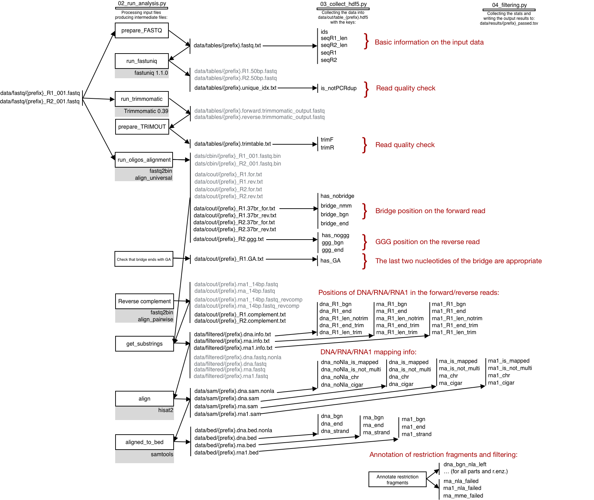

# Red-C nextflow pipeline

## Introduction

Welcome to Red-C RNA-DNA interactome mapping with [nextflow](https://www.nextflow.io/).

Red-C is a novel method for genome-wide detection of RNA-DNA interactions in chromatin.
The details are in our [NAR paper](https://doi.org/10.1093/nar/gkaa457) from 09 July, 2020:

```
Gavrilov, A.A., Zharikova, A.A., Galitsyna, A.A., Luzhin, A.V., Rubanova, N.M., Golov, A.K., 
Petrova, N.V., Logacheva, M.D., Kantidze, O.L., Ulianov, S.V. and Magnitov, M.D., 2020. 
Studying RNA–DNA interactome by Red-C identifies noncoding RNAs associated with various chromatin 
types and reveals transcription dynamics. 
Nucleic Acids Research.
```

The initial pipeline (RedClib) was implemented in Python and was hard to scale. 
From now on, we support the **nextflow pipeline redc-nf**. 

Pros:
  - You can easily change the parameters of run. 
  - The data processing is parallel and scalable. 
  - No need to re-run from scratch due to nextflow [resume](https://www.nextflow.io/blog/2019/demystifying-nextflow-resume.html) functionality. 
  - You can switch off unneded processing steps. 

Cons: none detected

## System requirements

1. You need a system supporting nextflow pipelines. For example, you can create conda environment with nextflow, 
   which will contain redc-nf dependencies:

```
conda env create -n redc-nf -f environment.yml 
conda activate redc-nf
conda install -c bioconda nextflow
```
   
2. Run test example:

```
nextflow redc.nf -params-file project.yml
```

This example should take up to 1 minute. 
you may want to check that the results are the same as we provide in `test/` folder. 

3. Adjust `project.yml` for your needs. You may vary libraries, 
   input files, genome, RNA annotation, restriction enzymes, filters, 
   output files and their content, 
   chunk size for splitting the data, oligos and trimming parameters. 
   
`project.yml` has inline documentation that should explain the details. 

4. Check out the results of mapping and annotation of your RNA-DNA contacts. 
   In case of troubles, visit and improve our [issues page](https://github.com/agalitsyna/RedClib/issues).

## RedClib description

This is outdated pipeline description of RedClib, but might provide some hints on the inner 
structure of redc-nf pipeline: 


